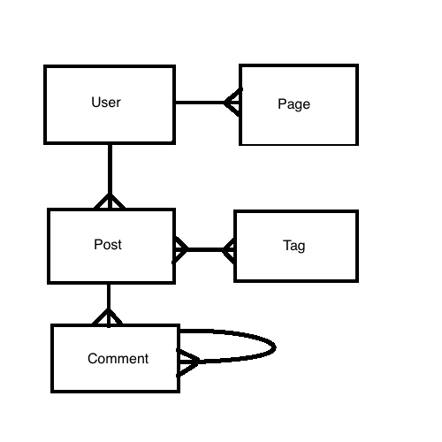
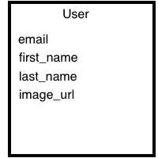
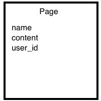
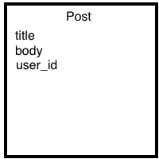
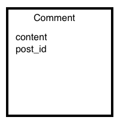
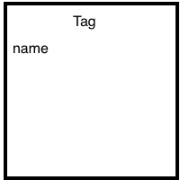

# Micro Blog
## A Group Prep

| Core Goals |
| :---|
| Review **CRUD** |
| Review **Associations** like `has_many`, `has_many ... through` |
| Review **Model Validations** |
| Review **Form Helpers** and **Routing** |
| Practice **Mobile First Design** using **Bootstrap** |
| Practice **Model** and **Request** specs |
| Research **Polymorphic Associations** |
| Research and practice **Git Workflow**: **branching**, **pull requests**, **merging**|
| Research **Partials** and avoid any **form** or **view** related repetition |
| Research **Flash** errors in Rails |

### Description

This is not a solo project for anyone. However, you should work out beforehand how much you'll be able to participate over the weekend. Recommended group sizes are from 3 to 5. This will not be your team for project II, but it will the team you build your understanding with until project II.

### Due Date

* There will be a **Monday Check-in** where this project will be expected to be completed.
* You will continue working on this together *Monday* and *Tuesday* to add extra session related features.

#### Background

You and some friends have won a freelance contract to build a micro-blogging prototype for a client. The prototype does not need to have *sessions*, but needs to demonstrate most of the relationships that the application will have. 

After talking to the client you have come up with the following **ERD**.

#### ERD

#### Tables

#### Associations

##### User

* should have many `posts`, and `pages` 
* should have some way of accessing `tags` related to a **User**

##### Post

*  belongs to a `user` 
* `has_many :tags` through a `PostTags` model
* `has_many :comments, as: :commentable` (See [this polymorphic association link](http://guides.rubyonrails.org/association_basics.html#polymorphic-associations).

##### Tag

* `has_many` posts through `PostTags`
* bonus: should have a way of looking up `users` with associated tags

##### Comment

* belongs to either a `post` or `comment` see polymorphic associations

##### Page

* `belongs_to` a `user`

#### Validations

[Be sure to try to display errors](http://guides.rubyonrails.org/active_record_validations.html#displaying-validation-errors-in-views)

##### User

* verify `email`
	* confirmation ([*research it*](http://guides.rubyonrails.org/active_record_validations.html#confirmation)) 
	* presence 
	* uniqueness 
	* format with `regex` 
* verify `first_name` and `last_name`
	* presence

##### Post

* verify `title`
	* max length 
	* presence
* verify `body`
	* max length
	* presence 

##### Tag

* verify `name`
	* `uniqueness`
	* presence
	* max and min length
	* format
		* no spaces or special characters
	 

##### Comment

* verify `content`
	* length min, max
	* presence 

##### Page

* verify `name`
	* inclusion must be `about` or `contact`
	* presence true
* verify `content`
	* presence 

#### Routing

 Should have resources for the following, but is not limited to this. Your group should always map out the `user` flow and `wireframes`.
 
 Think about setting up resources for the following
 
 * users
 * posts nested under users
 * pages nested under users
 * `users/:user_id/tags/:tag_id`
 * root
 * `/about_us`
 * `post '/posts/:post_id/comments'`
 
 > Note: you will have also map out how to `comment` on an existing `comment` (Hint: this will require more routes and methods in the comments controller :wink: ... )
 
 Should have the following controllers
 
 * `Site` controller
 	* `home` the root
 	* `about_us`
 * `Users` with full CRUD
 * `Posts` with full CRUD
 * `Pages` everything except `index`
 * `Comments` only `create`
 	* `create` redirects to `post` show
 * `TagUsers` 
 	* only `show`, for the `users/:user_id/tags/:tag_id` route
 	* the `show` will display all the posts associated to a `tag` for a `user
 
**Explanation**

Why such meager `TagUsers` and `Comments` controllers?

> Because `tags` will be displayed on every `posts` view as well as on the `TagUsers#show` view. Similarly, `comments` will be shown on every `posts#show` and added there is no need to show it individually, but you will need a create for a comment, because there should be a `comment` form on the show page for each `post`. 

#### Bonus Routes

* `Delete  Comment`

## Requirements

#### Before Anything

* Wireframe all views
* Review and discuss all model relationships, create your own erd.
* Review, discuss, and document any necessary routes
* Setup your `Github` workflow

#### Next Steps

* Research any unknowns
* Setup models, associations, validations
* Test model functionality
	* validations when creating, updating, finding, et cetera 
	* test associations in rails console and rspec
* Setup routes, controllers, and views
* Request specs
	* check response status
* All out styling
	* use bootstrap and make it responsive

### Bonus

* Deploy your application to [Heroku](https://devcenter.heroku.com/articles/getting-started-with-rails4) 
* Implement responsive design in your application (start thinking how your app would look on different devices) and use this [tutorial](http://www.revillweb.com/tutorials/bootstrap-tutorial/) to help
